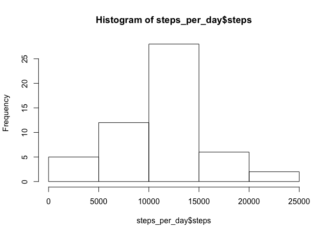
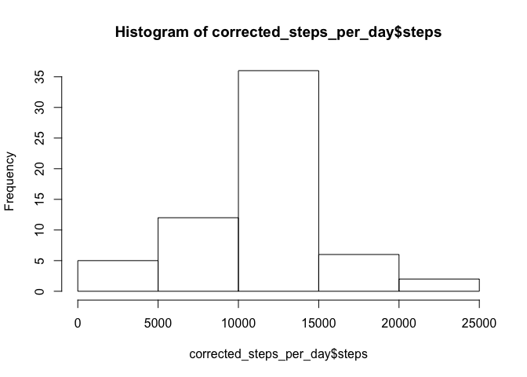
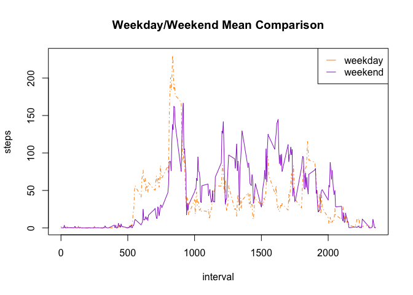

# Reproducible Research: Peer Assessment 1


## Loading and preprocessing the data


```r
library(sqldf)
```

```
## Loading required package: gsubfn
## Loading required package: proto
## Loading required package: RSQLite
## Loading required package: DBI
```

```r
# Setup
setwd("/code/coursera/reproducibledata/RepData_PeerAssessment1/")

if(!file.exists("./activity.csv")){
  unzip("./activity.zip")
}

activity <- read.csv("./activity.csv", stringsAsFactors = FALSE)
```

## What is mean total number of steps taken per day?

```r
complete_activities <- complete.cases(activity[,"steps"])
complete_activities <- activity[complete_activities,]

steps_per_day <- aggregate(steps ~ date, data = complete_activities, sum)
hist(steps_per_day$steps, plot = TRUE)
```

 

```r
mean(steps_per_day$steps)
```

```
## [1] 10766.19
```

```r
median(steps_per_day$steps)
```

```
## [1] 10765
```

## What is the average daily activity pattern?

```r
activity_step_interval <- aggregate(steps ~ interval, data = complete_activities, mean)
plot(steps ~ interval, data = activity_step_interval, type = "l")
```

 

```r
activity_step_interval[which.max(activity_step_interval$steps),]$interval
```

```
## [1] 835
```

## Imputing missing values

```r
#1 Calculate and report the total number of missing values in the dataset (i.e. the total number of rows with NAs)
missing_val_count <- nrow(activity) - nrow(complete_activities)

#2 Devise a strategy for filling in all of the missing values in the dataset. The strategy does not need to be sophisticated. For example, you could use the mean/median for that day, or the mean for that 5-minute interval, etc.
#Calculate by interval and create "corrected activities"
dt_interval <- sqldf('SELECT avg(steps) mean, interval FROM complete_activities GROUP BY interval')
```

```
## Loading required package: tcltk
```

```r
incomplete <- sqldf('SELECT date, interval FROM activity WHERE steps IS NULL')
nas_averaged <- sqldf('SELECT dt_interval.mean steps, incomplete.date, dt_interval.interval FROM incomplete JOIN dt_interval ON incomplete.interval = dt_interval.interval')

#3 Create a new dataset that is equal to the original dataset but with the missing data filled in.
corrected_activities <- rbind(nas_averaged, complete_activities)

#4 Make a histogram of the total number of steps taken each day and Calculate and report the mean and median total number of steps taken per day. 
# TODO: Do these values differ from the estimates from the first part of the assignment? 
# TODO: What is the impact of imputing missing data on the estimates of the total daily number of steps?
corrected_steps_per_day <- aggregate(steps ~ date, data = corrected_activities, sum)
hist(corrected_steps_per_day$steps, plot = TRUE)
```

 

```r
mean(corrected_steps_per_day$steps)
```

```
## [1] 10766.19
```

```r
median(corrected_steps_per_day$steps)
```

```
## [1] 10766.19
```


## Are there differences in activity patterns between weekdays and weekends?

```r
library(lubridate)
library(dplyr)
```

```
## 
## Attaching package: 'dplyr'
## 
## The following objects are masked from 'package:lubridate':
## 
##     intersect, setdiff, union
## 
## The following objects are masked from 'package:stats':
## 
##     filter, lag
## 
## The following objects are masked from 'package:base':
## 
##     intersect, setdiff, setequal, union
```

```r
# Sunday = 1, Saturday = 7
corrected_activities <- mutate(corrected_activities, week_or_weekend = ifelse(wday(ymd(date)) > 1 & wday(ymd(date)) < 7, "weekday", "weekend") )
corrected_activities$week_or_weekend = factor(corrected_activities$week_or_weekend, levels = c("weekday", "weekend"))

weekend_interval = aggregate(steps ~ interval + week_or_weekend, corrected_activities, mean)
par(mfrow=c(1,1))  
with(weekend_interval, plot(steps ~ interval, type="n", main="Weekday/Weekend Mean Comparison"))  
with(weekend_interval[weekend_interval$week_or_weekend == "weekday",], lines(steps ~ interval, type="l", col="darkorange", lty=4))  
with(weekend_interval[weekend_interval$week_or_weekend == "weekend",], lines(steps ~ interval, type="l", col="darkorchid" ))  
legend("topright", lty=c(1,1), col = c("darkorange", "darkorchid"), legend = c("weekday", "weekend"), seg.len=1)
```

 

**On average, there is an overall higher activity level on the weekends, but there are some outliers where activity levels are higher on weekdays for some intervals**
